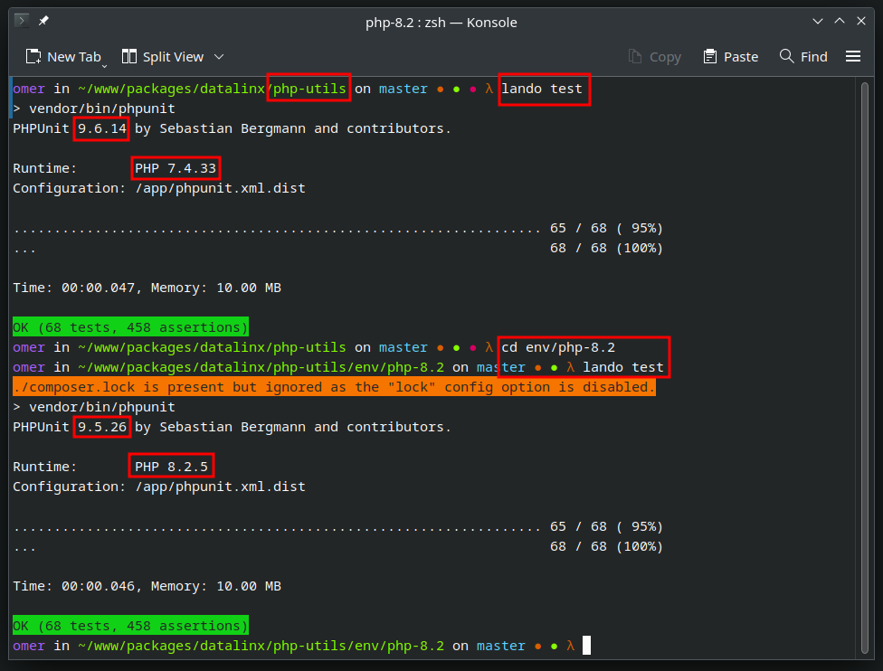

# Running tests for a specific PHP version with Lando
Instead of repeatedly changing the PHP version in the `lando.yml` file and running `composer update` or pushing your changes to test in CI, you can easily set up alternative Lando containers for local testing.

<!-- TOC -->
* [Running tests for a specific PHP version with Lando](#running-tests-for-a-specific-php-version-with-lando)
  * [Goals](#goals)
    * [Why not use `nektos/act`](#why-not-use-nektosact)
  * [Setting it up](#setting-it-up)
    * [Create the alternative `composer.json` file](#create-the-alternative-composerjson-file)
    * [Create the alternative `lando.yml` file](#create-the-alternative-landoyml-file)
    * [Initialize the Lando container](#initialize-the-lando-container)
  * [Running tests](#running-tests)
  * [Integration with PhpStorm](#integration-with-phpstorm)
  * [Additional environments](#additional-environments)
  * [Maintenance](#maintenance)
  * [Conclusion](#conclusion)
<!-- TOC -->

## Goals
We want a solution that:

✅ is self-contained and does not involve changing main source files  
✅ ships with the repository, lives in the same project  
✅ does not require running `composer update` between testing with different PHP versions  
✅ has the least amount of duplicated code/configuration and is easy to maintain  
✅ is more practical than pushing to CI and waiting for the results



This is achieved by:
* using an alternative `lando.yml` with much of the same stuff, but different target PHP version
* using a custom `composer.json` file that inherits/merges the main `composer.json`
* not using a `composer.lock` file

Mainly, the only point of duplication is the `lando.yml` file, which as it would appear, does not support any kind of inheritance/overloading from multiple directories. So when you change your Lando setup, you will have to remember to update the environment specific ones too.

However, the file that frequently changes is `composer.json` and this is accounted for and solved by the solution below.

### Why not use `nektos/act`
While it seemed promising, during local testing with [`nektos/act`](https://github.com/nektos/act), there were problems:
* It does not use the same exact Docker image as GitHub Actions, so there were differences in the OS setup and the workflow file had to be modified.
* It's slow. It took several minutes to run the entire test suite (with the entire matrix setup), while the Lando solution is really fast.
* You have to run the entire matrix or temporarily modify the workflow file to only run the desired variant.
* It's not as flexible as Lando. For example, you cannot run a specific test file or a specific test method.
* It can't be nicely integrated with PhpStorm.
* It generates a lot of output with no way of turning it off, which makes it hard to read the test results.
* You have to be careful not to do certain jobs or step, like triggering external services, if you use them in your workflow.

Currently, I see benefit in using it only for locally testing the CI workflow file (using the dry-run option) before pushing it to VCS.

## Setting it up
To get started, in the project root, create an `env` directory and a subdirectory for the target PHP version, e.g. `env/php-8.2`.

### Create the alternative `composer.json` file
We will use the [wikimedia/composer-merge-plugin](https://github.com/wikimedia/composer-merge-plugin) to merge the main `composer.json` into the one for the target PHP version.

In the subdirectory, create a new `composer.json` that will merge your source `composer.json`:
```json
{
    "require": {
        "wikimedia/composer-merge-plugin": "dev-master"
    },
    "extra": {
        "merge-plugin": {
            "require": [
                "/usr/local/src/composer.json"
            ],
            "merge-scripts": true
        }
    },
    "config": {
        "lock": false,
        "allow-plugins": {
            "wikimedia/composer-merge-plugin": true
        }
    },
    "autoload": {
        "psr-4": {
            "DataLinx\\PhpPackageTemplate\\": "src/"
        }
    },
    "autoload-dev": {
        "psr-4": {
            "DataLinx\\PhpPackageTemplate\\Tests\\": "tests/"
        }
    }
}
```
Since JSON does not support comments, here is a breakdown of the above:
* `require` - require the `wikimedia/composer-merge-plugin` package
* `extra.merge-plugin.require` - the list of files to merge, in this case the source `composer.json` file
* `extra.merge-plugin.merge-scripts` - merge the `scripts` section of the source `composer.json` file
* `config.lock` - disable the `composer.lock` file
* `config.allow-plugins` - allow the `wikimedia/composer-merge-plugin`
* `autoload` and `autoload-dev` - the same as in the source `composer.json` file — unfortunately, it seems these cannot be merged even though the plugin supposedly supports it


### Create the alternative `lando.yml` file

As stated above, the lando configuration cannot be merged, so we need to create a new `lando.yml` file for the target PHP version.

1. Copy the relevant `lando.yml` file from the project root to the `env/php-8.2` directory.
2. Customize the copied `lando.yml` file to your needs:
    * Change `name` to make it unique, like adding a suffix to the container name, e.g. `my-package-8.2`.
    * Set the `type` for the `appserver` service to `php:8.2` or change the `overrides.image` to a custom one, if you're using one.
3. Configure the `appserver` service:
    * Set `appmount` to `delegated`.
    * Set the volume mounts as seen below.
4. If you have a tooling entry for a composer script, you must update `cmd` to use the long `composer run-script myscript` format, because the merge plugin [does not support the short `composer myscript` format](https://github.com/wikimedia/composer-merge-plugin#merge-scripts).

You should end up with a custom `lando.yml` file that looks somewhat like this:
```yaml
name: my-package-8.2
services:
  appserver:
    type: php:8.2
    via: cli
    app_mount: delegated
    overrides:
      volumes:
        # Mount the project root directory to /app
        - "../..:/app"
        # Prevent the source vendor directory to be mounted
        - /app/vendor
        # Make available the source composer.json to be used by the merged one
        - "../../composer.json:/usr/local/src/composer.json"
        # Use the merged composer.json instead of the source one
        - "./composer.json:/app/composer.json"
tooling:
  test:
    service: appserver
    description: Run tests
    cmd: "composer run-script test"
```

For the full setup example, you can also see the `env/php-8.2` directory in this repository.

### Initialize the Lando container
In the environment directory, run:
```shell
lando start
```
Let the container be built and initialized.

After that, you must install the dependencies:
```shell
lando composer update
```
⚠️ **You have to enter this command twice**, since the first time, the merge plugin will be installed and there will be some errors:
```shell
./composer.lock is present but ignored as the "lock" config option is disabled.
Cannot update only a partial set of packages without a lock file present. Run `composer update` to generate a lock file.

Update to apply merge settings failed, reverting ./composer.lock to its original content.
```

Only with the second `update` command, the dependencies that were merged from the source `composer.json` will be installed.

## Running tests
There isn't much to say here, just run the tests in the environment dir. If you have the tooling entry like above, just run:
```shell
lando test
```

## Integration with PhpStorm
This is also pretty straightforward. It involves creating another interpreter and a run configuration.

See the [Testing with PhpStorm](Testing%20with%20PhpStorm.md) page for details.

However, note the following:
* For the interpreter, you must select the new Docker Compose configuration files from your `.lando/compose` directory.
* Name your interpreter something like `Lando (PHP 8.2)` to distinguish it from the main one.
* When creating a new Run configuration, be sure to select the new interpreter.

## Additional environments
Of course, there are no limits to the number of alternative environments you can create (apart from your storage 🙂). Just create a new directory in the `env` directory and follow the steps above.
You could have multiple PHP versions, or you could test with different services or versions of those services, etc.
Basically, whatever you do in the CI testing workflow, you can (and should?) do locally.

One common use case would be testing with different dependency versions. For example, to test with the lowest supported versions, run:
```shell
lando composer update --prefer-lowest
```
Or, instead of doing that, you can create a new environment, e.g. `env/php-8.2-lowest` and set up the `composer.json` file to require the lowest versions of the dependencies.

## Maintenance
You need to revisit the points above when you change:
* your Lando setup/configuration
* any section in the source `composer.json` file that is not merged into the environment specific one

## Conclusion
This is it. You can now run your tests with the new PHP version and debug them in PhpStorm.

Another great thing about it is that the alternative environment volumes are persisted between container restarts, so it's specific dependencies will be there until you replace them with another `composer update`. You don't have to install the dependencies each time you spin up the container, so apart from saving time, it's a pretty "green" solution 🍀


