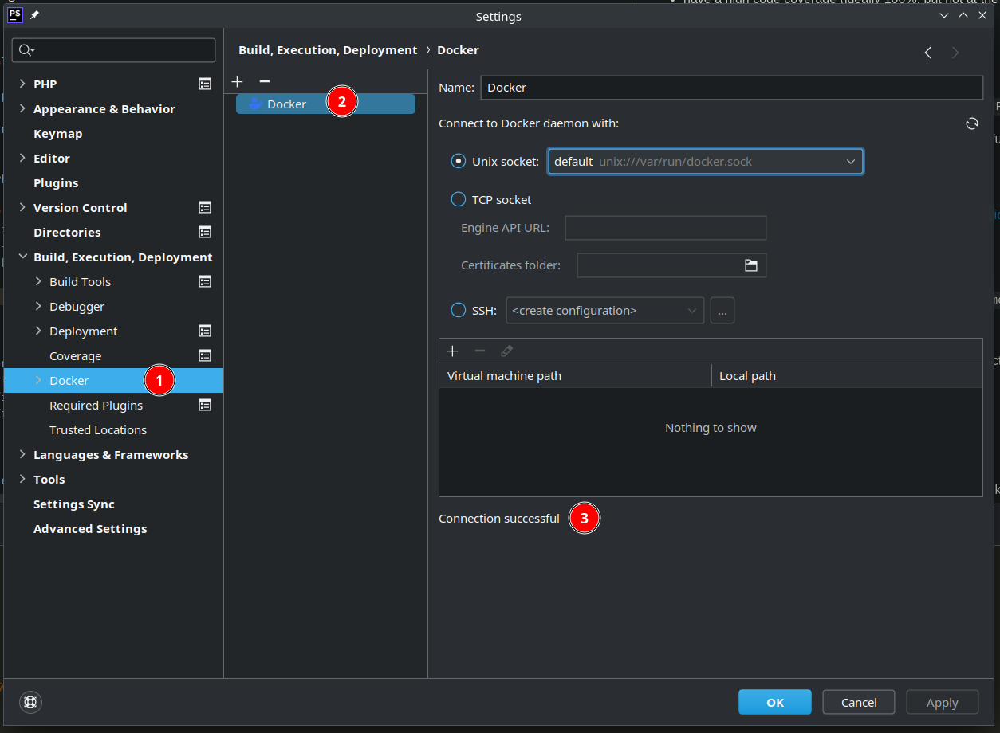
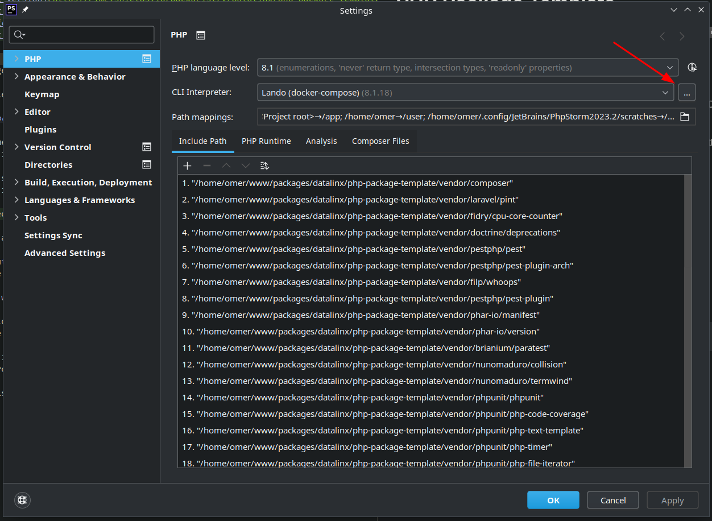
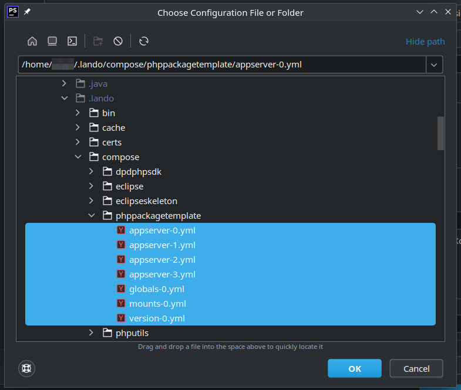
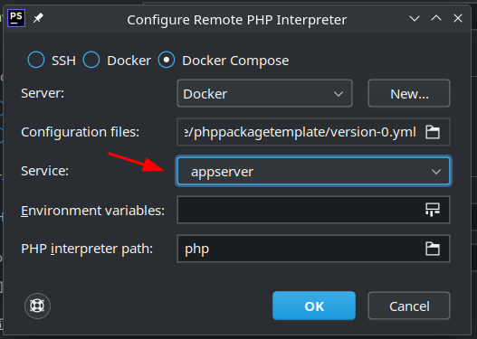
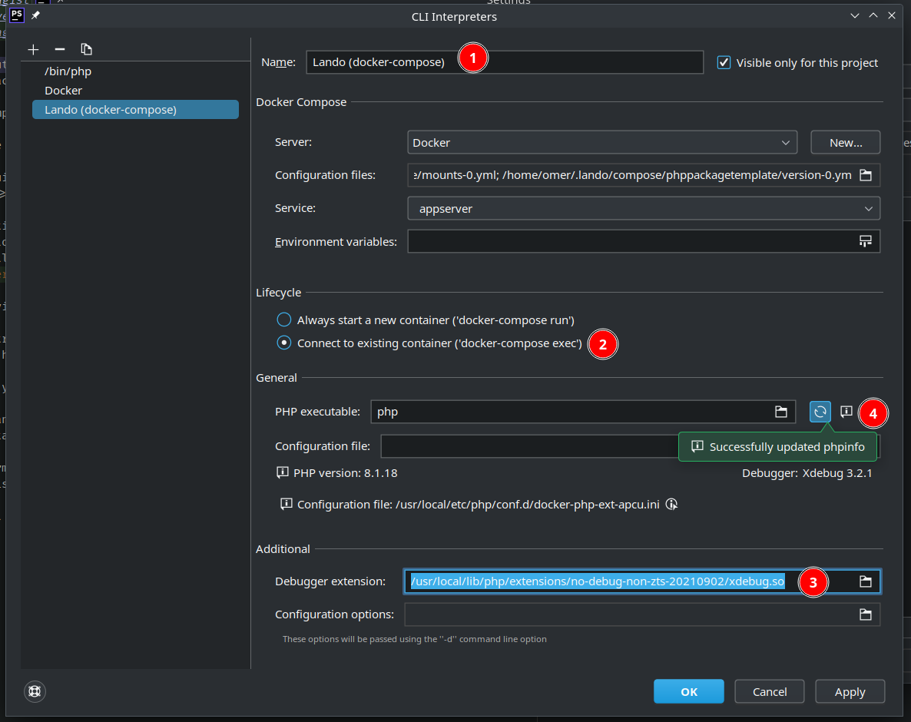
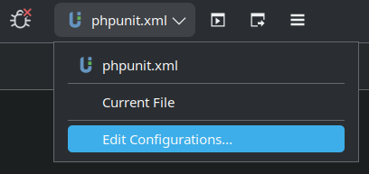
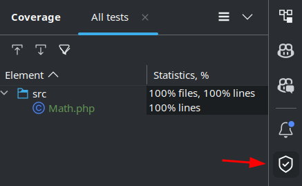
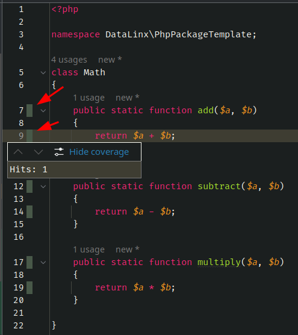

Setting up a fully integrated PhpStorm testing and debugging experience consists of three main steps.

Please note that despite what the Lando documentation page says, as things currently are, it's not required to add any xdebug entry to the Lando config file.
Debugging works out of the box, as long as the instructions below are followed.

## Docker connection
Add the Docker connection, if you don't have it already:
* Go to `Settings > Build, Execution, Deployment > Docker`
* Click the `+` button
* Configure the connection to your Docker daemon
* Click `OK`

Your setup might differ, but it should look something like this:

## PHP CLI interpreter
Set up the PHP CLI interpreter:
* Go to `Settings > PHP`
* Next to the `CLI Interpreter` dropdown, click the three dots  
  

* In the new window, click the `+` button in the top left and select `From Docker, Vagrant, VM, WSL...`  
  

* The "Configure Remote PHP Interpreter" window opens, where you need to:
    * Select `Docker compose`, so that PhpStorm connects to the existing and running instance of the Docker container, which is already configured by the Lando config file.
    * For `Configuration files`, set the files that Lando created in your `.lando` directory.  
      
    * After the `Service` dropdown is populated, select `appserver`  
      
    * That's it, press `OK`

* You are now back at the CLI Interpreters window, where the new interpreter is now selected and more configuration options are available. Here you need to:
    * Set a name for the interpreter. We recommend setting `Lando (docker-compose)` so it's clear that it runs through the Lando-configured container.
    * For `Lifecycle`, select `Connect to existing container ('docker-composer exec)`.
    * In the `Additional` fieldset, for the `Debugger extension` set the Xdebug extension.
        * For PHP 8.1 this should be:  
          `/usr/local/lib/php/extensions/no-debug-non-zts-20210902/xdebug.so`
        * You can always find your correct path to `xdebug.so` by SSH-ing into the container (`lando ssh`) and running the command:  
          `find /usr/local/lib/php/extensions -name 'xdebug.so'`
    * If you did everything correctly, you can now click the `Reload phpinfo` button and the correct PHP/Xdebug info will be displayed.  
      

## Set up the test runner
This is the last step and it's the easiest one.

* Open the `Run/Debug Configurations` window in the IDE. The PhpStorm UI changes frequently, but it should be somewhere in the `Run` toolbar.  
  
* In the top left corner, click the `+` button and select `Pest`.
* The runner config will now open and here you should:
    * Name the runner (1). "All tests" is recommended for the main test suite that includes all tests.
    * Set `Defined in the configuration file` for the test scope (2).
    * Set the correct CLI interpreter (3), if you have different ones (i.e. for testing in different PHP versions)
    * Enable `Store as project file` (4) for the test runner that should be distributed to other developers and does not have any of your specific configuration options.  
      It's a good idea to share the default runner, especially when it needs some special configuration options.  
      If you as a developer need specifics, you should create your own runner, not share it in VCS and perhaps set `Use alternative configuration file` if you created a local `phpunit.xml` to use instead of the `phpunit.xml.dist` file that came with the package.
    * In the end, it should end up looking something like this:  
      

That's it! You should now be able to run tests, debug (by setting breakpoints in source code) and generate code coverage. The latter will also be visible in the Coverage tool window and also in the source code, which is nifty:

